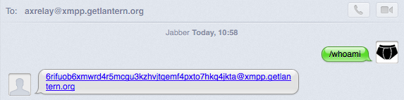
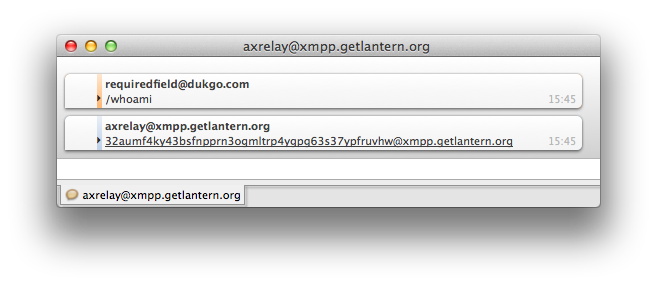
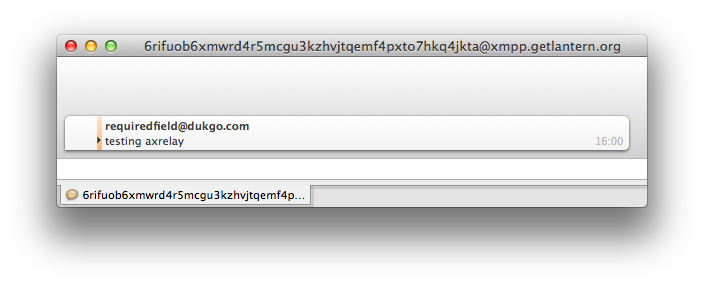
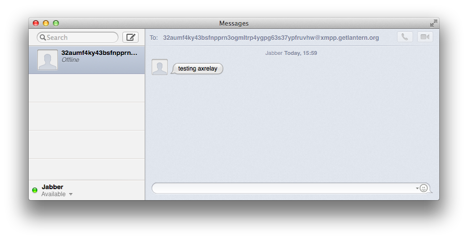
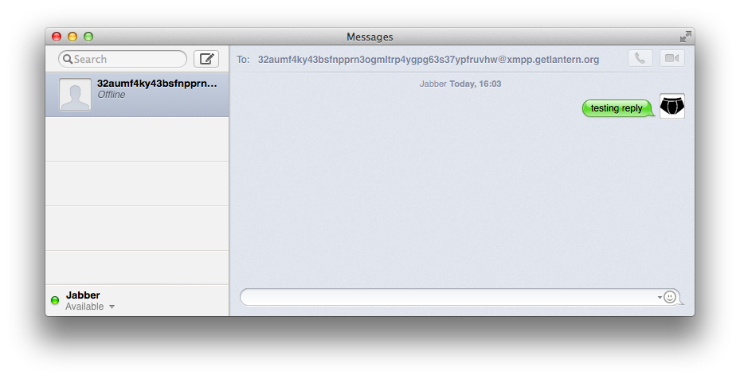
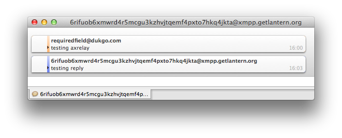

# axrelay

axrelay is an anonymizing xmpp relay component for xmpp servers.


## Setting up a server

*The following steps were tested on a freshly created and updated Ubuntu 13.10 Digital Ocean droplet in March 2014.*

*Become root as needed.*

### Install dependencies

    apt-get install git python-pip libpython-dev libmemcached10 libmemcached-dev memcached zlib1g-dev ejabberd

Note that this installs ejabberd 2.1.10-5ubuntu1 as the xmpp server, and memcached 1.4.14-0ubuntu4.1 as the anonymized jid store.

Install up-to-date versions of pip and virtualenv:

    pip install -U pip virtualenv

### Set up ejabberd

    vim /etc/ejabberd/ejabberd.cfg

Change

    {acl, admin, {user, "", "localhost"}}.

under "%% Admin user" on line 58 to

    {acl, admin, {user, "admin", "xmpp.getlantern.org"}}.

Change

    {hosts, ["localhost"]}.

under "%% Hostname" on line 61 to

    {hosts, ["localhost", "xmpp.getlantern.org"]}.

In the "LISTENING PORTS" section, add an entry for axrelay around line 188 like:

```erlang
%% axrelay component
{5560, ejabberd_service, [
                          {ip, {127, 0, 0, 1}},
                          {access, all},
                          {shaper_rule, fast},
                          {host, "xmpp.getlantern.org", [{password, "secret"}]}
                          ]},
```

changing "secret" to a secure password,
and note that a port besides 5560 can be used.
Using a hostname of "localhost" instead of "xmpp.getlantern.org" does not work, however.

**TODO**: document how to configure SSL

Now restart ejabberd to pick up the changes:

    /etc/init.d/ejabberd stop
    ps ax | grep beam  # ensure it's really no longer running (this can bite you)
    /etc/init.d/ejabberd start

Now create the admin user:

    ejabberdctl register admin xmpp.getlantern.org abracadabra

replacing "abracadabra" with a secure password,
and make sure you can log in to the server
from an xmpp client
as admin@xmpp.getlantern.org
with the supplied password
(requires pointing an A record from xmpp.getlantern.org to your server's IP address first).

### Set up axrelay

Install axrelay in a virtualenv using pip:

    virtualenv axrelay
    axrelay/bin/pip install -e 'git+https://github.com/getlantern/axrelay.git#egg=axrelay-dev'

Make sure you can now run the axrelay binary:

    axrelay/bin/axrelay help

Create a configuration file:

    cp axrelay/src/axrelay/sample.conf /usr/local/etc/axrelay.conf
    vim /usr/local/etc/axrelay.conf

(axrelay looks for configuration in /usr/local/etc/axrelay.conf by default.)

The configuration in the **[relay]** section
must match the configuration for the axrelay component in /etc/ejabberd/ejabberd.cfg
documented above, e.g.

```ini
[relay]
jid      = axrelay@xmpp.getlantern.org
# using "localhost" instead of "127.0.0.1" here causes axrelay to use ipv6,
# which can make it fail to connect to the xmpp server:
server   = 127.0.0.1
port     = 5560
password = (the secure password you set in ejabberd.cfg earlier)
```

For the **[hash]** section,
run "axrelay secret" to create a new secret for the "secret" setting.
The "domain" setting is the domain which will be used for anonymized jids
(e.g. "xmpp.getlantern.org")
and should be the domain the xmpp server is listening on
to allow messages sent to the anonymized addresses to be received and relayed to the original addresses by axrelay.

axrelay supports an in-memory store for the jid mappings,
but the memcached store is appropriate for production use.

(This allows mappings to be stored and retrieved from the command line
while memcached is running
via "axrelay hash --store \<original\_jid\>" and "axrelay hash --lookup \<anonymized\_jid\>",
which is handy for testing.)

To use the memcached store,
leave the **[memcache]** section of the axrelay config uncommented,
and leave the **[local\_storage]** section commented out.

After running the "apt-get install" command above, a memcached instance was installed and automatically started on your server. Run "/etc/init.d/memcached status" to verify it's running.

To use this memcached instance as axrelay's anonymized jid store, leave the "servers" setting set to "localhost".

Run "axrelay secret" again and use the result for the "encrypt" setting
to make axrelay encrypt keys and values in the store.

Finally, run axrelay:

    axrelay/bin/axrelay run --debug

You should see something like the following indicating it connected to ejabberd successfully:

```
2014-03-08 16:30:29,032 DEBUG    Connecting to 127.0.0.1:5560
2014-03-08 16:30:29,033 DEBUG    Connecting to 127.0.0.1:5560
2014-03-08 16:30:29,035 DEBUG    Event triggered: connected
2014-03-08 16:30:29,035 DEBUG     ==== TRANSITION disconnected -> connected
2014-03-08 16:30:29,036 DEBUG    Starting HANDLER THREAD
2014-03-08 16:30:29,038 DEBUG    Loading event runner
2014-03-08 16:30:29,039 DEBUG    SEND (IMMED): <stream:stream xmlns="jabber:component:accept" xmlns:stream="http://etherx.jabber.org/streams" to='axrelay@xmpp.getlantern.org'>
2014-03-08 16:30:29,043 DEBUG    RECV: <stream:stream from="axrelay@xmpp.getlantern.org" id="1554921912">
2014-03-08 16:30:29,044 DEBUG    SEND (IMMED): <handshake xmlns="jabber:component:accept">f0916cb81cde3fc44641d630388b639a3777bc21</handshake>
2014-03-08 16:30:29,046 DEBUG    RECV: <handshake />
2014-03-08 16:30:29,047 DEBUG    Event triggered: session_bind
2014-03-08 16:30:29,048 DEBUG    Event triggered: session_start
```

### Test axrelay

On your own machine, use one xmpp client (e.g. Adium) to log in with one xmpp account, e.g. requiredfield@dukgo.com,
and use another xmpp client (e.g. Messages.app) to log in with another account, e.g. \_pants@dukgo.com.

*Use dukgo.com accounts for testing since they are free to create
and the dukgo.com xmpp server will reliably federate with your xmpp server.
Google's xmpp servers have been known to not always federate with other xmpp servers.*

*Using different xmpp clients is recommended just to make it easier to keep straight which messages are coming from which accounts.*

*If using Messages.app, you may need to check the "Notify me about messages from unknown contacts" checkbox in Preferences \> General.*

Now send a message from \_pants@dukgo.com to axrelay@xmpp.getlantern.org with body "/whoami".
You should get a reply from axrelay@xmpp.getlantern.org with \_pants's new anonymous jid:



Now send a message from requiredfield@dukgo.com to axrelay@xmpp.getlantern.org with body "/whoami".
You should get a reply with requiredfield's new anonymous jid:



Now send a message from requiredfield@dukgo.com to \_pants's anonymous jid:



\_pants@dukgo.com should now receive a message with the body of the message you just sent, but coming from requiredfield's anonymous jid:



\_pants@dukgo.com should be able to reply to this message:



and requiredfield@dukgo.com should get it:


